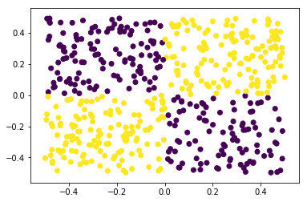

knnFeat
====

Feature Extraction with KNN

## Description
Python implementation of feature extraction with KNN.  

The following is R implementation:  
http://davpinto.com/fastknn/articles/knn-extraction.html#understanding-the-knn-features

## Requirements
- Python 3.x
  - numpy
  - scikit-learn
  - scipy

## Install
```
git clone git@github.com:upura/knnFeat.git
cd knnFeat
pip install -r requirements.txt
```

## Demo
Notebook version can be seen [here](https://github.com/upura/knnFeat/blob/master/demo.ipynb).
### Packages for visualization
```python
import numpy as np
%matplotlib inline
import matplotlib.pyplot as plt
```

### Data generation
```python
x0 = np.random.rand(500) - 0.5
x1 = np.random.rand(500) - 0.5
X = np.array(list(zip(x0, x1)))
y = np.array([1 if i0 * i1 > 0 else 0 for (i0, i1)  in list(zip(x0, x1))])
```

### Visualization


### Feature extraction with KNN
```python
from knnFeat import knnExtract
newX = knnExtract(X, y, k = 1, holds = 5)
```

### Visualization


## Algorithm
Quote from [here](http://davpinto.com/fastknn/articles/knn-extraction.html#understanding-the-knn-features).

> It generates k * c new features, where c is the number of class labels. The new features are computed from the distances between the observations and their k nearest neighbors inside each class, as follows:

> 1. The first test feature contains the distances between each test instance and its nearest neighbor inside the first class.
> 2. The second test feature contains the sums of distances between each test instance and its 2 nearest neighbors inside the first class.
> 3. The third test feature contains the sums of distances between each test instance and its 3 nearest neighbors inside the first class.
> 4. And so on.

> This procedure repeats for each class label, generating k * c new features. Then, the new training features are generated using a n-fold CV approach, in order to avoid overfitting. 

## Licence

[MIT](https://github.com/tcnksm/tool/blob/master/LICENCE)

## Author

[upura](https://github.com/upura)
